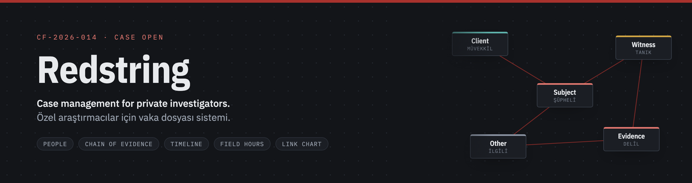
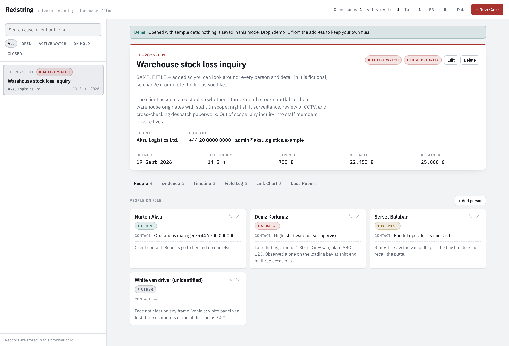
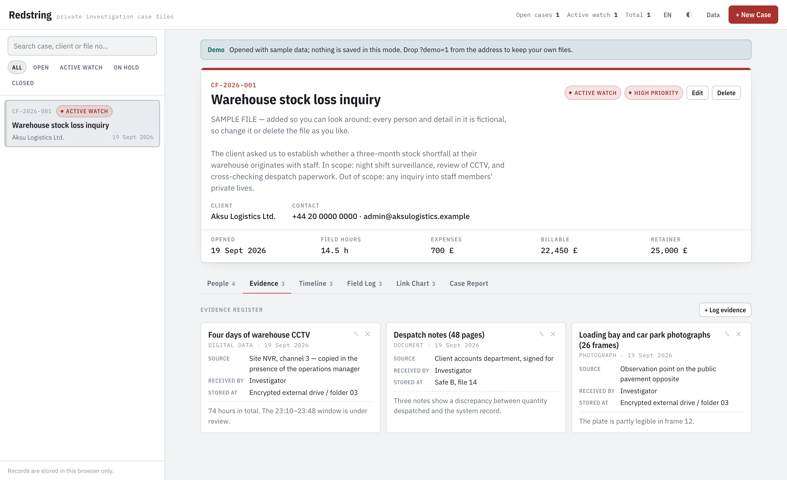
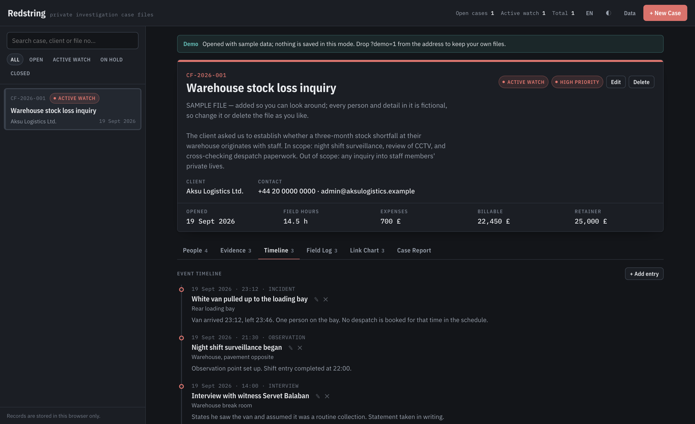
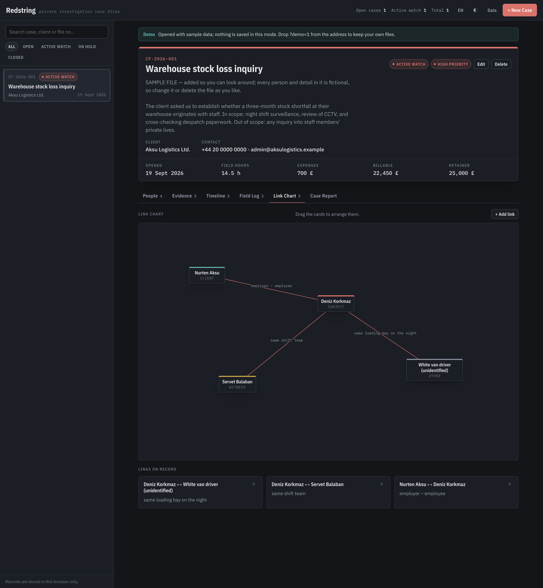
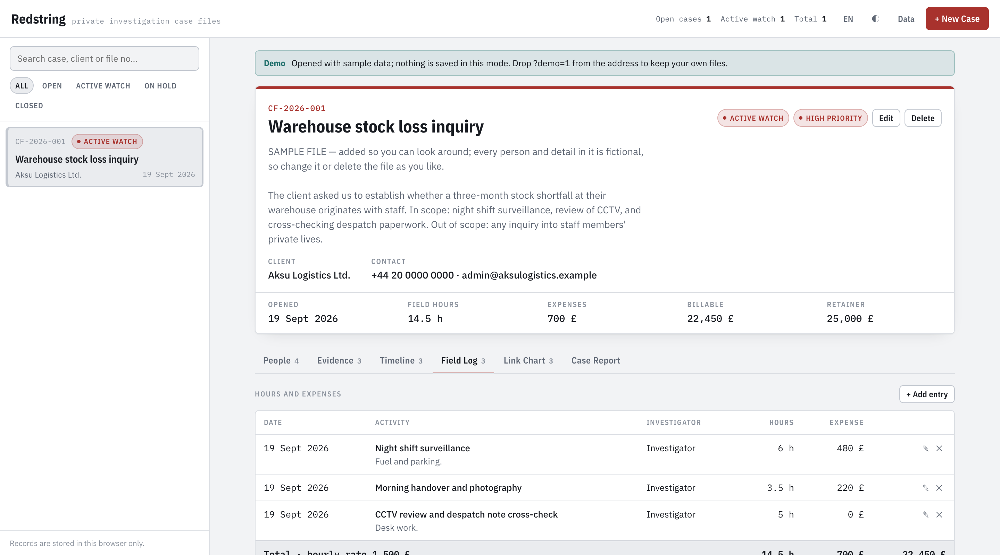
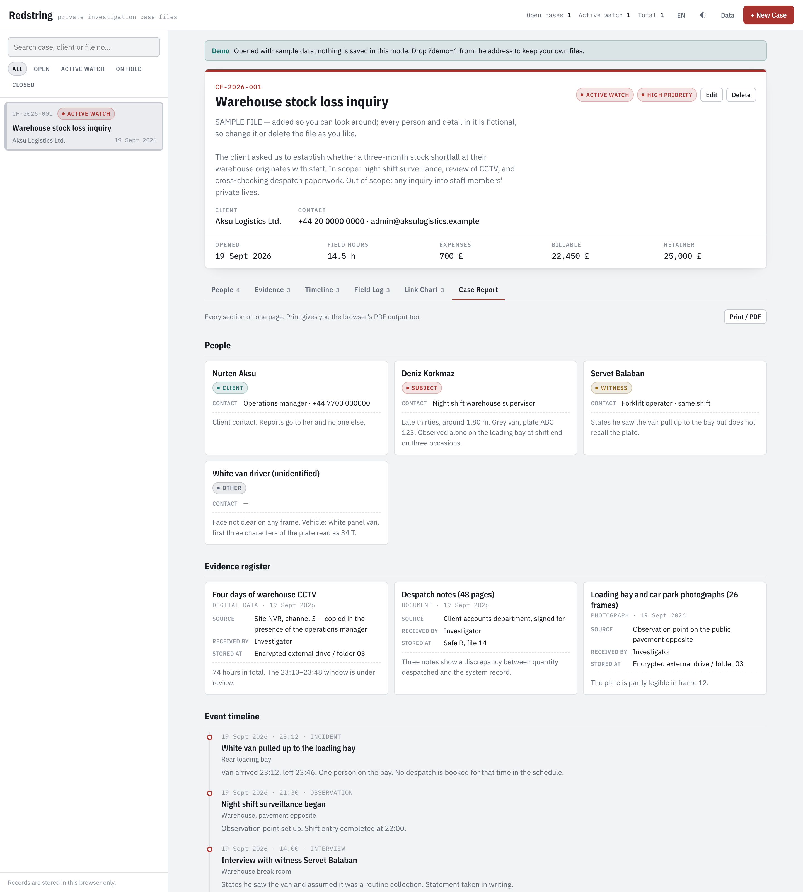
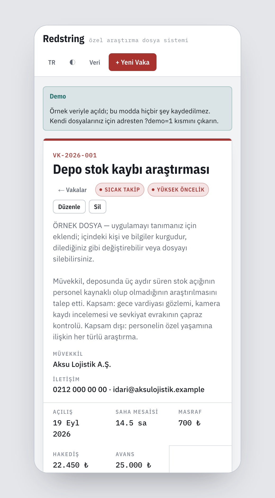

<p align="center">
  
</p>

<p align="center">
  <a href="https://github.com/gorkemguler/redstring/actions/workflows/deploy-pages.yml"></a>
  
  
  
  
  
  
</p>

<p align="center">
  <a href="README.md">Türkçe</a> · <b>English</b>
</p>

<p align="center">
  <a href="https://gorkemguler.github.io/redstring/?lang=en"><b>Open the app →</b></a>&nbsp;&nbsp;·&nbsp;&nbsp;
  <a href="https://gorkemguler.github.io/redstring/?demo=1&lang=en">Try it with a sample case</a>
</p>

# Redstring

Case management for private investigators. Every case keeps its **people, chain of evidence,
event timeline, field hours and link chart** in one file, and prints as a single case report.

A single-page static web app. No build step, no package manager, no dependencies and no server —
opening `index.html` is enough.

Named after the red string that runs between people on the link chart. The project began in
Turkish as *Vaka Masası* — "case desk" — and the interface still ships in both languages.

## For fellow investigators: how to use it

No installation, no account, no fee. Open **<https://gorkemguler.github.io/redstring/?lang=en>** and create your first file.

Your records stay **in your own browser**; they reach neither us nor anyone else — there is no
server behind this site. Two investigators using the same address never see each other's files.
That puts the responsibility on you: take regular backups with **Data → Download as JSON**.

To look around first, <https://gorkemguler.github.io/redstring/?demo=1&lang=en> opens with a sample case and saves nothing.

---

## Screenshots

### Case header and people

Client, status, priority and the financial summary sit at the top the moment a file opens, and
the billable total is worked out from field hours and expenses. The coloured edge on each card in
the left rail marks its priority.



### Evidence register

Every item is logged with the fields a chain of custody needs: where it came from, who received
it, and where it is stored right now.



### Event timeline

Observations, interviews and incidents go in with their times; the timeline orders itself newest
first.



### Link chart

People on the file sit on a board with red string drawn between them. Drag the cards to arrange
them — their positions are saved with the case.



### Field hours and expenses

Shifts and expenses go into a table; the footer row applies the hourly rate and gives the
billable total.



### Case report

Every section on one page. Print gives you the browser's PDF output; the interface is hidden
during printing so only the case content goes on paper.



### Turkish interface and mobile layout

The **TR / EN** button switches the interface instantly and the choice is remembered. On a narrow
screen the list and the case file become separate views.

| Turkish | Mobile |
|---|---|
|  |  |

---

## What's in it

| Section | Contents |
|---|---|
| **Header** | File no, client, status, priority, hourly rate, retainer; billable total derived from hours and expenses |
| **People** | Client / subject / witness / victim / other, with descriptions and contact details |
| **Evidence** | Chain-of-custody fields: where it came from, who received it, where it is stored |
| **Timeline** | Time-stamped event log, newest first |
| **Field Log** | Shifts and expenses with a totals row |
| **Link Chart** | A draggable board connecting people with red string |
| **Case Report** | Every section on one page; prints or exports to PDF |

Also: case search and status filters (`/` jumps to the search box), Turkish/English interface,
light–dark–system theme, configurable currency symbol, JSON backup and restore, live sync between
open tabs, and a sample case you can add with one click.

---

## Where the data lives

**Records are kept in your browser's `localStorage` and nowhere else.** Nothing is sent to a
server; there is no server behind this. In practice:

- Records belong to **that device and that browser**; they do not appear on another machine.
- Clearing site data deletes them.
- Nothing persists in a private window — the app says so with a banner at the top.
- There is no real-time collaboration; tabs open on the same device update each other instantly.

So take regular backups with **Data → Download as JSON**. The same menu restores a backup on
another device, either merging it into the existing records or replacing them.

> [!IMPORTANT]
> **Personal data.** This app holds information about real people. Under GDPR, KVKK and comparable
> regimes you are the data controller: keep device disk encryption on, store backup JSON files in
> an encrypted location, and delete files once their retention period ends. On a shared computer,
> run the app in a separate browser profile.

---

## Running it

Double-click `index.html`. If you prefer a local server:

```bash
python3 -m http.server 8080
```

Then open <http://localhost:8080>.

## Publishing on GitHub Pages

`.github/workflows/deploy-pages.yml` is ready to go. Set **Settings → Pages → Build and deployment
→ Source** to **GitHub Actions**, and every push to `main` publishes the site.

If you would rather not use the workflow, **Deploy from a branch → main / (root)** on the same
screen works too; delete the workflow file in that case.

> A public repository means a public site. The app publishes **empty** — records are created in
> each visitor's own browser and your cases are never uploaded. Even so, keep the repository
> private when you work real files in it.

---

## URL parameters

You can steer how the app opens from the address bar. This is how demo links are shared and how
the screenshots above were produced.

| Parameter | Values | Effect |
|---|---|---|
| `demo` | `1` | Opens with the sample case and **saves nothing** — for demos |
| `lang` | `tr`, `en` | Forces the interface language |
| `theme` | `light`, `dark` | Forces the theme |
| `tab` | `taraflar`, `deliller`, `kronoloji`, `saha`, `sema`, `rapor` | Which tab to open |

Example: `index.html?demo=1&lang=en&tab=sema&theme=dark`

---

## Project layout

```
index.html              application shell
assets/app.css          theme tokens, layout, print styles
assets/app.js           data layer (localStorage), views, forms
assets/i18n.js          interface strings and the lists resolved per language
assets/sample.js        the sample case (TR + EN)
docs/banner-source.html source of the README banner
docs/mobile-frame.html  fixed-width frame used for the mobile screenshot
.github/workflows/      GitHub Pages deployment
```

No dependencies; the only external resource is the IBM Plex family from Google Fonts. It works
offline too — the type simply falls back to a system font.

## Adding a language

1. Add a block with the same keys to the `STR` object in `assets/i18n.js`.
2. List the language in `DILLER` in the same file: `{ id, ad, locale, kodOnek }`.
3. Add a label in your language code to every entry in the status, priority, role, evidence-type
   and event-type lists — the ids never change, because that is what the data stores.
4. Optionally add a sample case in that language to `assets/sample.js`.

The new language joins the rotation of the language button automatically.

## License

MIT — see [LICENSE](LICENSE).
