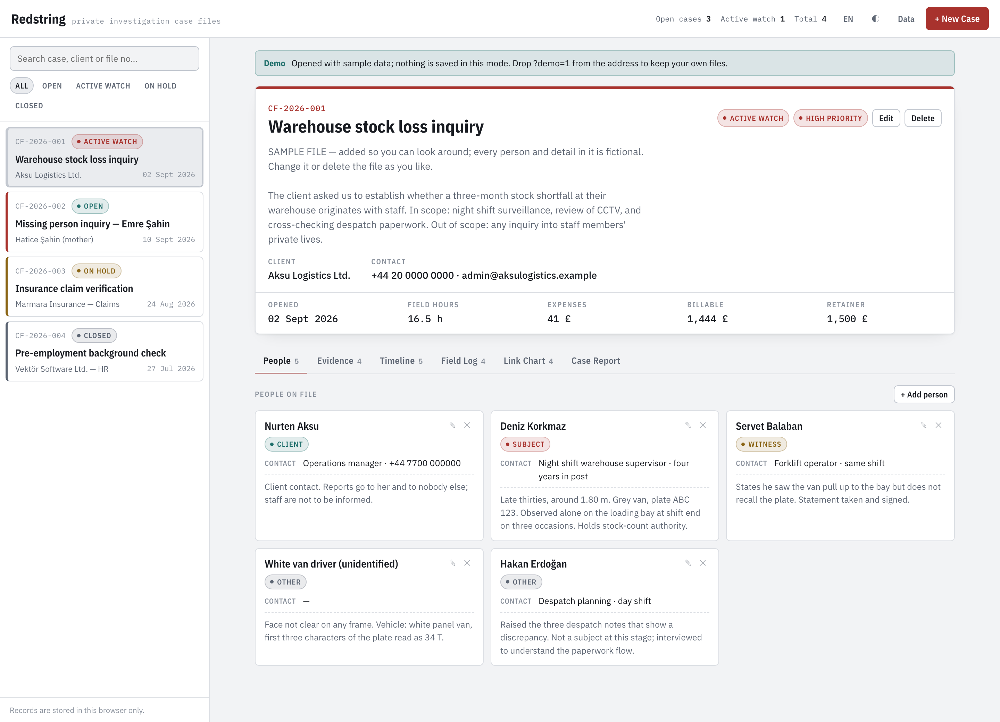
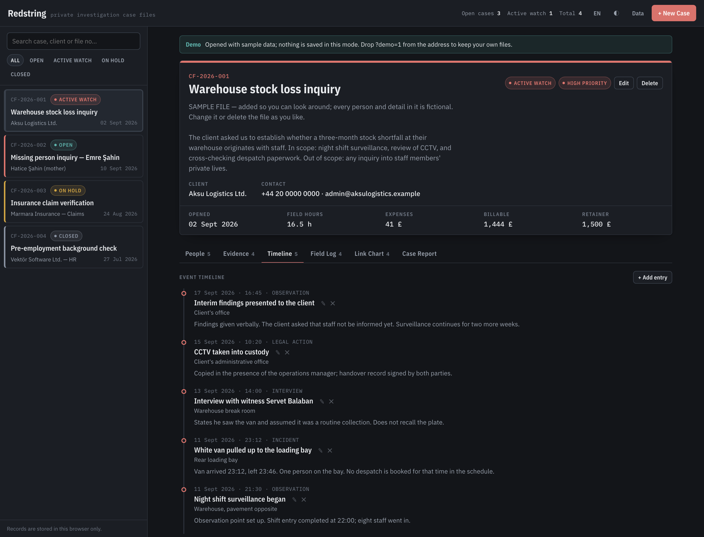
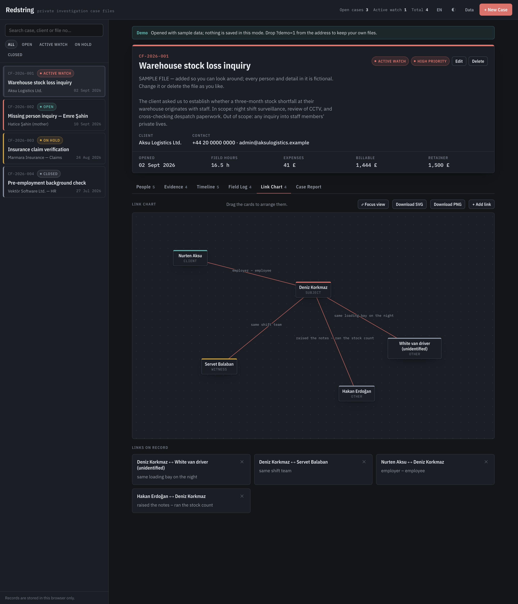
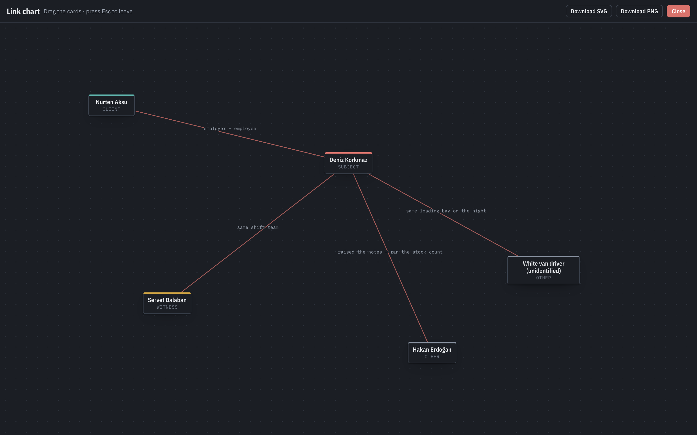
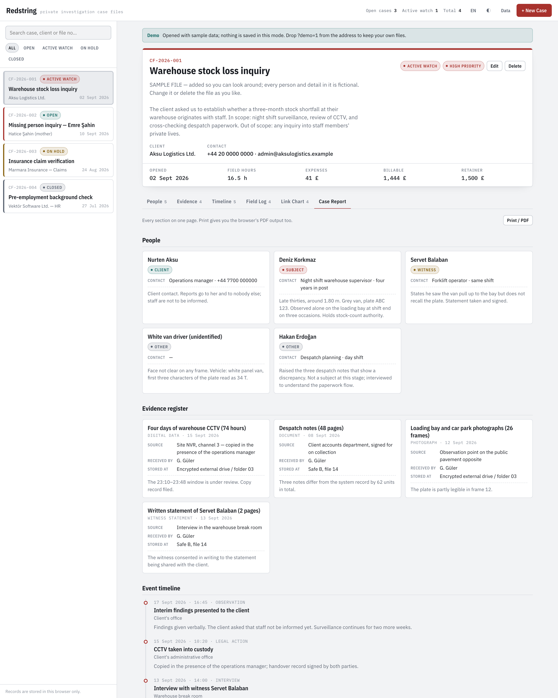
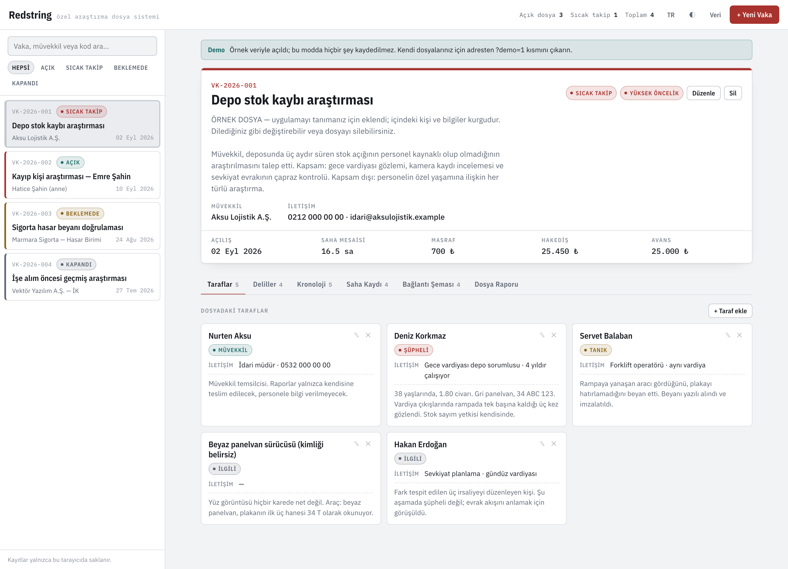
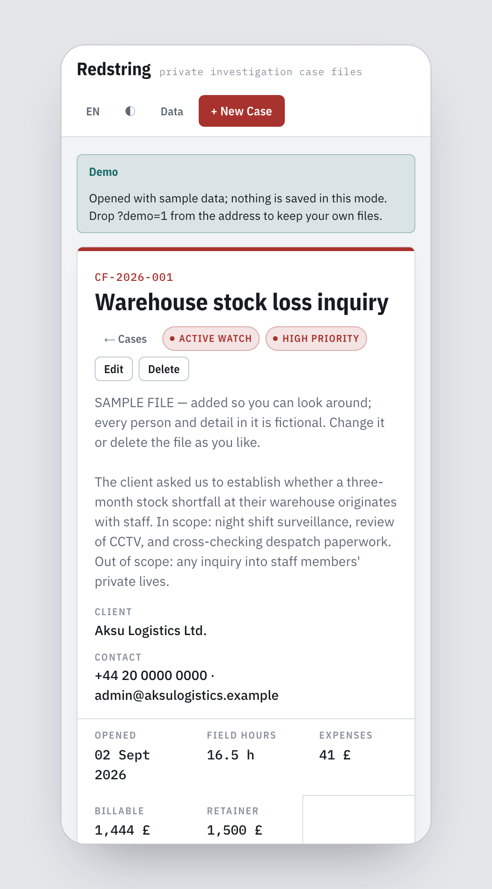

<p align="center">
  
</p>

<p align="center">
  <a href="https://github.com/gorkemguler/redstring/actions/workflows/deploy-pages.yml"></a>
  
  
  
  
  
  
  
</p>

<p align="center">
  <a href="README.tr.md">Türkçe</a> · <b>English</b>
</p>

<p align="center">
  <a href="https://gorkemguler.github.io/redstring/?demo=1&lang=en"><b>See the demo →</b></a>
  &nbsp;&nbsp;·&nbsp;&nbsp;
  <a href="#running-your-own-copy">Run your own copy</a>
</p>

# Redstring

**Case management for private investigators and detectives.** Every case keeps its **people,
chain of evidence, event timeline, field hours and link chart** in one file, and prints as a
single case report.

Named after the red string that runs between people on the link chart. The project began in
Turkish as *Vaka Masası* — "case desk" — and the interface still ships in both languages.

A single-page static web app. No build step, no package manager, no dependencies and no server —
opening `index.html` is enough, and a `Dockerfile` is there when you want it served properly.

---

## The demo is a look around. For real casework, run your own copy.

<https://gorkemguler.github.io/redstring/?demo=1&lang=en> is a **taster**. It opens with four
worked sample cases so you can see what the tool does in two minutes — a warehouse theft inquiry,
a missing person, an insurance claim verification and a closed background check, one for each case
status. Everyone in them is fictional and each file says so at the top.

The hosted page is a fully working app, not a crippled preview: whatever you type there is saved
in your own browser and nobody else can see it. But **for real files, install it on a machine you
control**, for reasons that have nothing to do with features:

- Your records sit on **your** disk, under **your** disk encryption, on a machine you can lock away.
- Nothing depends on this repository staying online, on GitHub, or on me.
- You choose where backups go and how long you keep them — which is what a retention policy needs.
- On a shared or office machine you can put it behind your own network and your own access control.

Installation is one command and it needs no internet after that. See
[Running your own copy](#running-your-own-copy).

---

## Screenshots

### Case header and people

Client, status, priority and the financial summary sit at the top the moment a file opens, and
the billable total is worked out from field hours and expenses. The coloured edge on each card in
the left rail marks its priority; the four sample files cover all four case statuses.



### Evidence register

Every item is logged with the fields a chain of custody needs: where it came from, who received
it, and where it is stored right now.


### Event timeline

Observations, interviews and incidents go in with their times; the timeline orders itself newest
first.



### Link chart

People on the file sit on a board with red string drawn between them. Drag the cards to arrange
them — their positions are saved with the case.



### Focus view — the chart on its own, full screen

**Focus view** gives the chart the whole window, which is where the thinking actually happens on a
crowded case. Drag the cards the same way, press `Esc` to leave. **Download SVG** and **Download
PNG** export the chart as a standalone image, redrawn from the data at a fixed 1400×900 — so it
comes out the same whatever screen you were on, ready to drop into a report or print for a wall.



### Field hours and expenses

Shifts and expenses go into a table; the footer row applies the hourly rate and gives the
billable total.


### Case report

Every section on one page. Print gives you the browser's PDF output; the interface is hidden
during printing so only the case content goes on paper.



### Turkish interface and mobile layout

The **TR / EN** button switches the interface instantly and the choice is remembered. On a narrow
screen the list and the case file become separate views.

| Turkish | Mobile |
|---|---|
|  |  |

---

## What's in it

| Section | Contents |
|---|---|
| **Header** | File no, client, status, priority, hourly rate, retainer; billable total derived from hours and expenses |
| **People** | Client / subject / witness / victim / other, with descriptions and contact details |
| **Evidence** | Chain-of-custody fields: where it came from, who received it, where it is stored |
| **Timeline** | Time-stamped event log, newest first |
| **Field Log** | Shifts and expenses with a totals row |
| **Link Chart** | A draggable board connecting people with red string, a full-screen focus view, and SVG / PNG export |
| **Case Report** | Every section on one page; prints or exports to PDF |

Also: case search and status filters (`/` jumps to the search box), Turkish/English interface,
light–dark–system theme, configurable currency symbol, JSON backup and restore, live sync between
open tabs, and sample cases you can re-add with one click.

---

## Where the data lives

**Records are kept in your browser's `localStorage` and nowhere else.** Nothing is sent to a
server; there is no server behind this app, hosted or self-installed. In practice:

- Records belong to **that device and that browser**; they do not appear on another machine.
- Clearing site data deletes them.
- Nothing persists in a private window — the app says so with a banner at the top.
- There is no real-time collaboration; tabs open on the same device update each other instantly.

So take regular backups with **Data → Download as JSON**. The same menu restores a backup on
another device, either merging it into the existing records or replacing them.

> [!IMPORTANT]
> **Personal data.** This app holds information about real people. Under GDPR, KVKK and comparable
> regimes you are the data controller: keep device disk encryption on, store backup JSON files in
> an encrypted location, and delete files once their retention period ends. On a shared computer,
> run the app in a separate browser profile.

---

## Running your own copy

### Docker (recommended)

```bash
git clone https://github.com/gorkemguler/redstring.git
cd redstring
docker compose up -d
```

Open <http://localhost:8080>. The image is nginx plus the static files: no database, no volumes, nothing to back up on the server side, because the server stores nothing. Stop it with
`docker compose down`.

Without compose:

```bash
docker build -t redstring .
docker run -d -p 8080:80 --name redstring redstring
```

### Without Docker

Double-click `index.html` — it works straight off the disk. If you would rather serve it:

```bash
python3 -m http.server 8080
```

Then open <http://localhost:8080>.

The only thing that needs the internet is the IBM Plex font from Google Fonts. Offline, the type
falls back to a system font and everything else works exactly the same.

## Publishing it on GitHub Pages

`.github/workflows/deploy-pages.yml` is ready to go. In your fork, set **Settings → Pages → Build
and deployment → Source** to **GitHub Actions**, and every push to `main` publishes the site.

> A public repository means a public site. The app publishes **empty** — records are created in
> each visitor's own browser and your cases are never uploaded. Even so, a machine you control is
> the right home for real files.

---

## URL parameters

You can steer how the app opens from the address bar. This is how demo links are shared and how
the screenshots above were produced.

| Parameter | Values | Effect |
|---|---|---|
| `demo` | `1` | Opens with the sample cases and **saves nothing** — for demos |
| `lang` | `tr`, `en` | Forces the interface language |
| `theme` | `light`, `dark` | Forces the theme |
| `tab` | `taraflar`, `deliller`, `kronoloji`, `saha`, `sema`, `rapor` | Which tab to open |
| `focus` | `1` | Opens the link chart full screen |

Example: `index.html?demo=1&lang=en&tab=sema&focus=1&theme=dark`

---

## Project layout

```
index.html              application shell
assets/app.css          theme tokens, layout, focus view, print styles
assets/app.js           data layer (localStorage), views, forms, chart export
assets/i18n.js          interface strings and the lists resolved per language
assets/sample.js        the four sample cases (TR + EN)
Dockerfile              nginx image for running your own copy
docker-compose.yml      one-command local install
docs/banner-source.html source of the README banner
docs/mobile-frame.html  fixed-width frame used for the mobile screenshots
.github/workflows/      GitHub Pages deployment
```

No dependencies; the only external resource is the IBM Plex family from Google Fonts.

## Adding a language

1. Add a block with the same keys to the `STR` object in `assets/i18n.js`.
2. List the language in `DILLER` in the same file: `{ id, ad, locale, kodOnek }`.
3. Add a label in your language code to every entry in the status, priority, role, evidence-type
   and event-type lists — the ids never change, because that is what the data stores.
4. Optionally add sample cases in that language to `assets/sample.js`.

The new language joins the rotation of the language button automatically.

## License

MIT — see [LICENSE](LICENSE).
