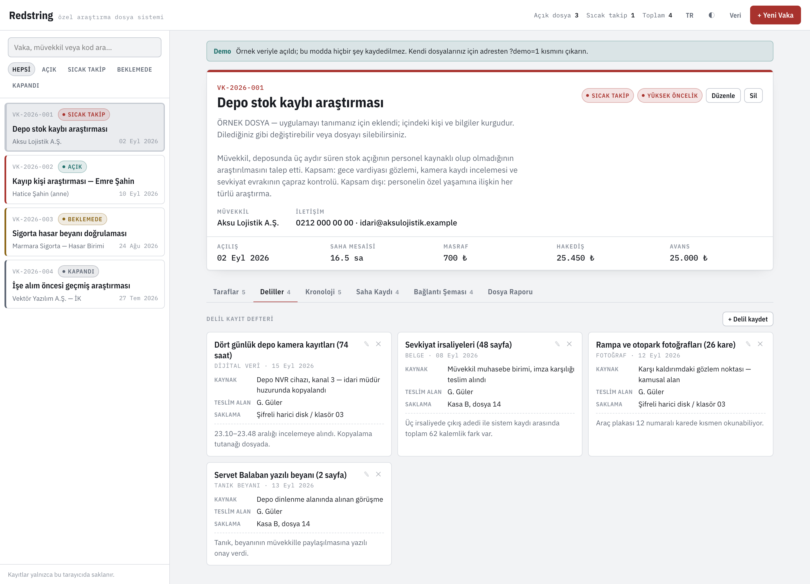
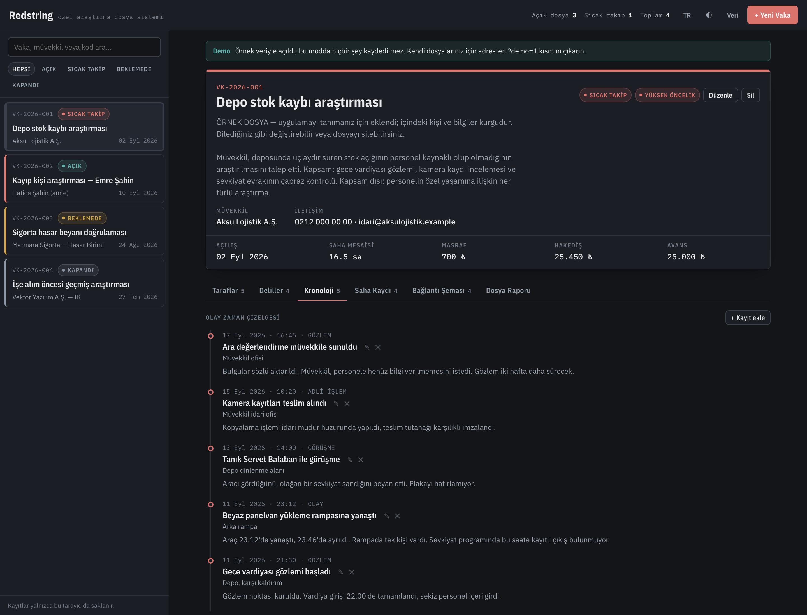
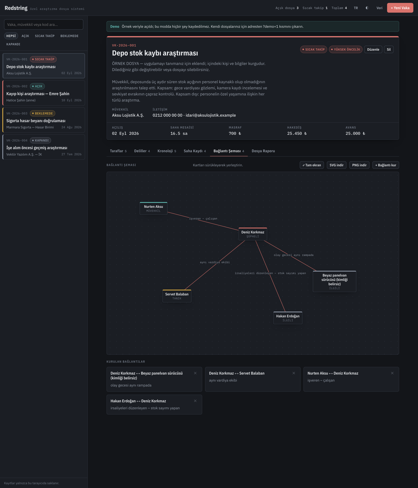
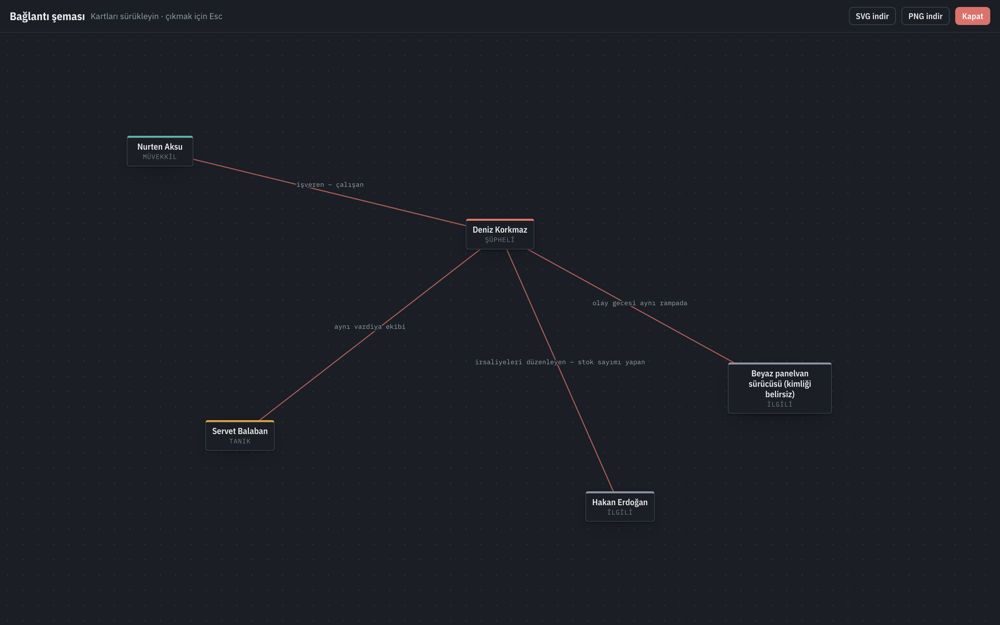
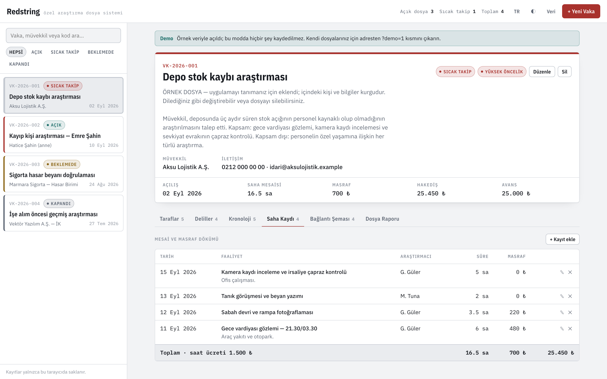
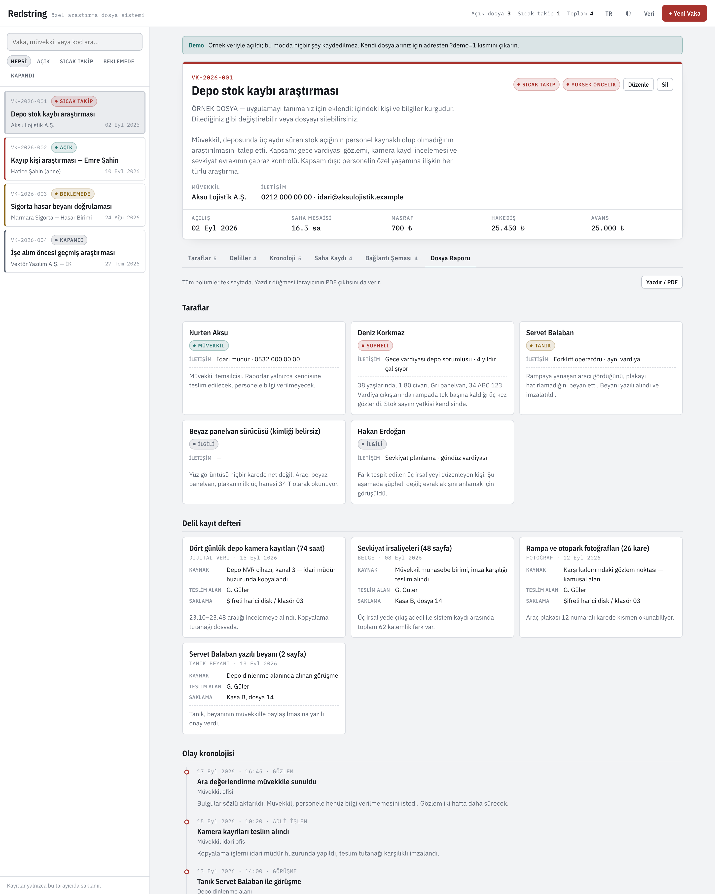
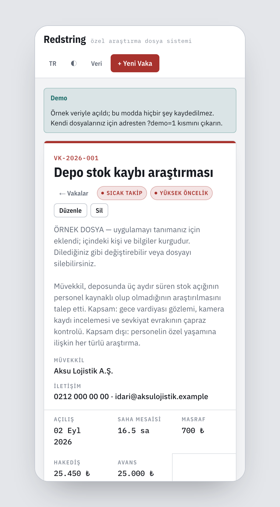

<p align="center">
  
</p>

<p align="center">
  <a href="https://github.com/gorkemguler/redstring/actions/workflows/deploy-pages.yml"></a>
  
  
  
  
  
  
  
</p>

<p align="center">
  <b>Türkçe</b> · <a href="README.md">English</a>
</p>

<p align="center">
  <a href="https://gorkemguler.github.io/redstring/?demo=1"><b>Demoyu gör →</b></a>
  &nbsp;&nbsp;·&nbsp;&nbsp;
  <a href="#kendi-kurulumunuz">Kendi kurulumunuzu yapın</a>
</p>

# Redstring

**Dedektifler ve özel araştırmacılar için vaka dosyası sistemi.** Her vaka için **taraflar, delil
zinciri, olay kronolojisi, saha mesaisi ve bağlantı şeması** tek dosyada toplanır; dosya raporu
tek tuşla yazdırılır.

Adını, kişileri birbirine bağlayan panodaki kırmızı iplerden alıyor. Proje Türkçe *Vaka Masası*
adıyla başladı; arayüz hâlâ tam Türkçe.

Tek sayfalık statik bir web uygulaması. Derleme adımı, paket yöneticisi, bağımlılık ve sunucu
yok — `index.html` dosyasını açmak yeterli; düzgün servis etmek isterseniz `Dockerfile` hazır.

---

## Demo bakmak içindir. Gerçek vakalar için kendi kurulumunuzu yapın.

<https://gorkemguler.github.io/redstring/?demo=1> bir **tanıtım**. Dört işlenmiş örnek dosyayla
açılır, böylece aracın ne yaptığını iki dakikada görürsünüz — depo hırsızlığı araştırması, kayıp
kişi, sigorta hasar doğrulaması ve kapanmış bir geçmiş araştırması; her vaka durumundan birer
tane. İçlerindeki herkes kurgudur ve her dosya bunu en başta yazar.

Yayındaki sayfa kısıtlanmış bir önizleme değil, tam çalışan uygulamadır: orada yazdığınız her şey
kendi tarayıcınıza kaydedilir ve başka kimse göremez. Ama **gerçek dosyalar için uygulamayı kendi
denetiminizdeki bir makineye kurun.** Bunun sebebi özellik eksikliği değil:

- Kayıtlarınız **sizin** diskinizde, **sizin** disk şifrelemenizin altında, kilitleyebileceğiniz
  bir makinede durur.
- Hiçbir şey bu deponun ayakta kalmasına, GitHub'a veya bana bağlı olmaz.
- Yedeklerin nereye gideceğine ve ne kadar saklanacağına siz karar verirsiniz — saklama
  politikasının gerektirdiği şey tam olarak budur.
- Ortak kullanılan bir ofis makinesinde kendi ağınızın ve kendi erişim denetiminizin arkasına
  alabilirsiniz.

Kurulum tek komut ve sonrasında internet bile gerektirmiyor. Bkz.
[Kendi kurulumunuz](#kendi-kurulumunuz).

---

## Ekran görüntüleri

### Vaka künyesi ve taraflar

Dosya açılır açılmaz müvekkil, durum, öncelik ve mali özet üstte görünür; saha mesaisi ile
masraftan hakediş kendiliğinden hesaplanır. Sol raydaki her kartın kenarındaki renk şeridi
önceliği gösterir; dört örnek dosya dört vaka durumunun hepsini kapsar.


### Delil kayıt defteri

Her delil, delil zincirinin gerektirdiği alanlarla kaydedilir: nereden elde edildi, kim teslim
aldı, şu an nerede saklanıyor.



### Olay kronolojisi

Gözlem, görüşme ve olaylar saatiyle işlenir; çizelge en yeniden eskiye kendiliğinden dizilir.



### Bağlantı şeması

Dosyadaki kişiler bir panoya yerleşir, aralarındaki ilişkiler kırmızı iplerle çizilir. Kartlar
sürüklenerek düzenlenir, konumları dosyayla birlikte saklanır.



### Tam ekran — şema tek başına, bütün pencerede

**Tam ekran**, şemaya bütün pencereyi verir; kalabalık bir vakada asıl düşünme işi orada olur.
Kartlar aynı şekilde sürüklenir, çıkmak için `Esc`. **SVG indir** ve **PNG indir** düğmeleri
şemayı bağımsız bir görsel olarak dışa aktarır — panodan kopyalanmaz, veriden sabit 1400×900
ölçüsünde yeniden çizilir. Yani hangi ekranda çalışırsanız çalışın çıktı aynı olur; rapora
koymaya ya da duvara asmak üzere basmaya hazır.



### Saha mesaisi ve masraf dökümü

Vardiyalar ve masraflar tabloya girilir; alt toplam satırı saat ücretiyle birlikte hakedişi verir.



### Dosya raporu

Bütün bölümler tek sayfada toplanır. Yazdır düğmesi tarayıcının PDF çıktısını da verir; yazdırma
sırasında arayüz gizlenir, yalnızca dosya içeriği basılır.



### İngilizce arayüz ve mobil görünüm

Arayüz üstteki **TR / EN** düğmesiyle anında değişir; seçim tarayıcıda hatırlanır. Dar ekranda
liste ve dosya ayrı görünümlere ayrılır.

| İngilizce | Mobil |
|---|---|
|  |  |

---

## Neler var

| Bölüm | İçerik |
|---|---|
| **Künye** | Dosya no, müvekkil, durum, öncelik, saat ücreti, avans; saha mesaisi ve masraftan hakediş otomatik |
| **Taraflar** | Müvekkil / şüpheli / tanık / mağdur / ilgili kayıtları, eşkâl ve iletişim bilgisiyle |
| **Deliller** | Delil zinciri alanları: nereden elde edildi, kim teslim aldı, nerede saklanıyor |
| **Kronoloji** | Saatli olay çizelgesi, en yeniden eskiye |
| **Saha Kaydı** | Vardiya ve masraf dökümü, alt toplam satırıyla |
| **Bağlantı Şeması** | Kırmızı iplerle bağlanan sürüklenebilir pano, tam ekran çalışma görünümü ve SVG / PNG dışa aktarma |
| **Dosya Raporu** | Tüm bölümler tek sayfada; yazdırılır veya PDF'e çıkar |

Ayrıca: vaka arama ve duruma göre filtreleme (`/` tuşu arama kutusuna atlar), Türkçe/İngilizce
arayüz, açık–koyu–sistem teması, para birimi ayarı, JSON yedek alma ve geri yükleme, birden fazla
sekme arasında anlık eşitleme, tek tuşla yeniden eklenebilen örnek vakalar.

---

## Veriler nerede duruyor

**Kayıtlar yalnızca tarayıcınızın `localStorage` alanında tutulur.** Hiçbir veri sunucuya
gönderilmez; ne yayındaki sayfanın ne de kendi kurulumunuzun arkasında bir sunucu vardır.
Pratikte bunun anlamı:

- Kayıtlar **o cihaza ve o tarayıcıya** bağlıdır; başka bilgisayarda görünmez.
- Tarayıcı site verisini temizlerseniz kayıtlar silinir.
- Gizli sekmede kayıt kalıcı olmaz — uygulama bunu üstte uyarı şeridiyle bildirir.
- Ekipçe eşzamanlı çalışma yoktur; aynı cihazda açık sekmeler birbirini anında günceller.

Bu yüzden **Veri → JSON olarak indir** ile düzenli yedek alın. Aynı menüden yedeği başka bir
cihazda geri yükleyebilir, mevcut kayıtlarla birleştirebilir veya onların yerine koyabilirsiniz.

> [!IMPORTANT]
> **Kişisel veri uyarısı.** Uygulama gerçek kişilere ait veri barındırır. KVKK kapsamında veri
> sorumlusu sizsiniz: cihaz disk şifrelemesini açık tutun, yedek JSON dosyalarını şifreli bir
> alanda saklayın, saklama süresi dolan dosyaları silin. Ortak kullanılan bir bilgisayarda
> uygulamayı ayrı bir tarayıcı profilinde çalıştırın.

---

## Kendi kurulumunuz

### Docker (önerilen)

```bash
git clone https://github.com/gorkemguler/redstring.git
cd redstring
docker compose up -d
```

<http://localhost:8080> adresini açın. İmaj nginx artı statik dosyalardan ibaret: veritabanı yok, volume yok, sunucu tarafında yedeklenecek hiçbir şey yok; çünkü sunucu hiçbir şey
saklamıyor. Durdurmak için `docker compose down`.

Compose kullanmadan:

```bash
docker build -t redstring .
docker run -d -p 8080:80 --name redstring redstring
```

### Docker olmadan

`index.html` dosyasına çift tıklayın — doğrudan diskten çalışır. Servis etmeyi tercih ederseniz:

```bash
python3 -m http.server 8080
```

Sonra <http://localhost:8080> adresini açın.

İnternet gerektiren tek şey Google Fonts üzerinden gelen IBM Plex yazı tipi. Çevrimdışıyken yazı
tipi sistem yazı tipine düşer, geri kalan her şey birebir aynı çalışır.

## GitHub Pages'te yayınlama

Depoda `.github/workflows/deploy-pages.yml` hazır. Kendi fork'unuzda **Settings → Pages → Build
and deployment → Source** ayarını **GitHub Actions** yapın; `main` dalına her gönderimde site
yayınlanır.

> Depo herkese açıksa siteniz de herkese açık olur. Uygulama **boş** yayınlanır — kayıtlar
> ziyaretçinin kendi tarayıcısında oluşur, sizin vakalarınız siteye yüklenmez. Yine de gerçek
> dosyaların yeri kendi denetiminizdeki bir makinedir.

---

## URL parametreleri

Adres çubuğundan uygulamanın açılışını yönlendirebilirsiniz. Demo bağlantısı paylaşmak veya
belge için ekran görüntüsü almak bunlarla yapılır.

| Parametre | Değer | Ne yapar |
|---|---|---|
| `demo` | `1` | Örnek vakalarla açar ve **hiçbir şeyi kaydetmez** — tanıtım için |
| `lang` | `tr`, `en` | Arayüz dilini zorlar |
| `theme` | `light`, `dark` | Temayı zorlar |
| `tab` | `taraflar`, `deliller`, `kronoloji`, `saha`, `sema`, `rapor` | Açılacak sekme |
| `focus` | `1` | Bağlantı şemasını tam ekran açar |

Örnek: `index.html?demo=1&lang=tr&tab=sema&focus=1&theme=dark`

---

## Dosya düzeni

```
index.html              uygulama kabuğu
assets/app.css          tema değişkenleri, yerleşim, tam ekran, yazdırma stilleri
assets/app.js           veri katmanı (localStorage), görünümler, formlar, şema dışa aktarma
assets/i18n.js          arayüz metinleri ve dile göre çözülen listeler
assets/sample.js        dört örnek vaka (TR + EN)
Dockerfile              kendi kurulumunuz için nginx imajı
docker-compose.yml      tek komutluk yerel kurulum
docs/banner-source.html README başlığındaki banner'ın kaynağı
docs/mobile-frame.html  mobil ekran görüntüleri için sabit genişlikli çerçeve
.github/workflows/      GitHub Pages yayın akışı
```

Bağımlılık yok; tek dış kaynak Google Fonts üzerinden gelen IBM Plex ailesi.

## Yeni dil eklemek

1. `assets/i18n.js` içindeki `STR` nesnesine aynı anahtarlarla yeni bir blok ekleyin.
2. Aynı dosyadaki `DILLER` dizisine dili yazın: `{ id, ad, locale, kodOnek }`.
3. Durum, öncelik, sıfat, delil türü ve olay türü listelerindeki her kayda dil kodunuzla bir
   etiket ekleyin — kimlikler (`id`) değişmez, veri onlarla saklanır.
4. İsterseniz `assets/sample.js` içine o dilde örnek vakalar ekleyin.

Arayüzde yeni dil, üstteki dil düğmesinin sırasına kendiliğinden katılır.

## Lisans

MIT — bkz. [LICENSE](LICENSE).
